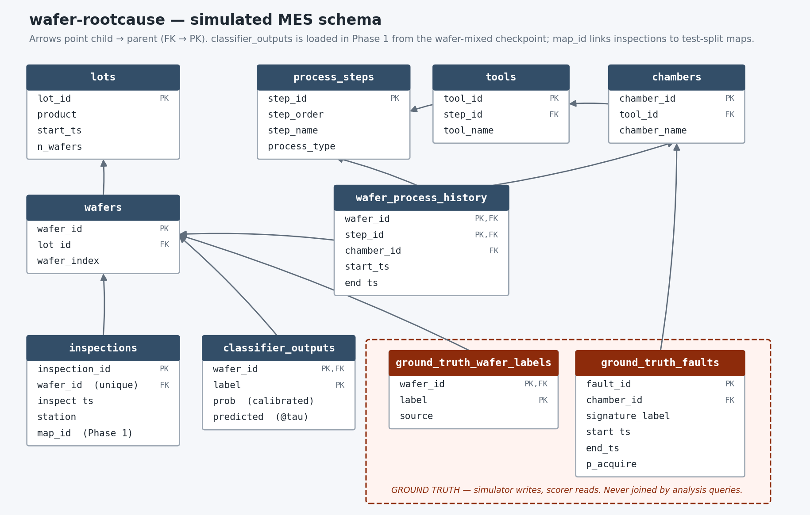

# wafer-rootcause

From *what defect pattern is on the wafer* to *which tool/chamber put it
there*: a simulated MES relational layer (lots, wafers, routes, tools,
chambers, timestamps) joined to **real classifier outputs** from
[wafer-mixed](https://github.com/ALEX8642/wafer-mixed), with commonality
analysis in SQL recovering planted faults against known ground truth —
attribution quality is *scored*, not asserted.

**Status: Phase 1 (classifier integration + SQL EDA) complete.** See
[STATUS.md](STATUS.md) for the phase log, [docs/SCHEMA.md](docs/SCHEMA.md)
for the schema, and [docs/EDA.md](docs/EDA.md) for the EDA.



## Quickstart

```bash
pip install -r requirements.txt
python scripts/build_db.py            # configs/sim_baseline.yaml → outputs/wafer_rootcause.duckdb
python scripts/attach_and_predict.py  # attach real test-split maps + run the classifier (CPU, ~3 min once)
python scripts/eda.py                 # named SQL queries in sql/ → assets/eda_*.png
pytest
```

`attach_and_predict.py` needs a sibling checkout of
[wafer-mixed](https://github.com/ALEX8642/wafer-mixed) (trained checkpoint,
thresholds, MixedWM38 data + persisted split) — path configurable in
`configs/attach_baseline.yaml`. Each simulated wafer is dressed with a real
MixedWM38 **test-split** map whose true label set matches the wafer's
simulated label set, then classified by wafer-mixed's checkpoint at its
calibrated per-label thresholds — so `classifier_outputs` carries the
model's honest test-split noise, not the simulator's truth.

All-CPU, no GPU anywhere in this project. Builds are deterministic:
same configs + seeds → identical database; inference is cached to parquet
and never re-runs on rebuild.

## Layout

- `sql/schema.sql` — the schema DDL (the analytics in this repo live in SQL)
- `sql/eda_*.sql` — named EDA queries (prevalence, rate by chamber, rate
  over time, lot yield, co-occurrence)
- `src/wafer_rootcause/` — simulator, config, map attachment, inference
  bridge, DB loading (Python is glue)
- `configs/` — declarative sim (`sim_baseline.yaml`) + attachment/inference
  (`attach_baseline.yaml`)
- `docs/SCHEMA.md` — data dictionary + design rules (ground-truth firewall);
  `docs/EDA.md` — the EDA narrative
- `tests/` — referential integrity, timestamp monotonicity, determinism,
  combo validity, fault-effect sanity, assignment consistency, prediction
  round-trip, live spot-check against wafer-mixed's own pipeline

## Simulated data only

Everything in this repo is simulated or derived from the public MixedWM38
dataset. No proprietary manufacturing data is present, and none will be
committed; the schema doubles as a rehearsal rig for a private MES extract
that stays off GitHub entirely.

Sibling repos: [wafer-defect-classifier](https://github.com/ALEX8642/wafer-defect-classifier) ·
[wafer-ssl](https://github.com/ALEX8642/wafer-ssl) ·
[wafer-mixed](https://github.com/ALEX8642/wafer-mixed)
