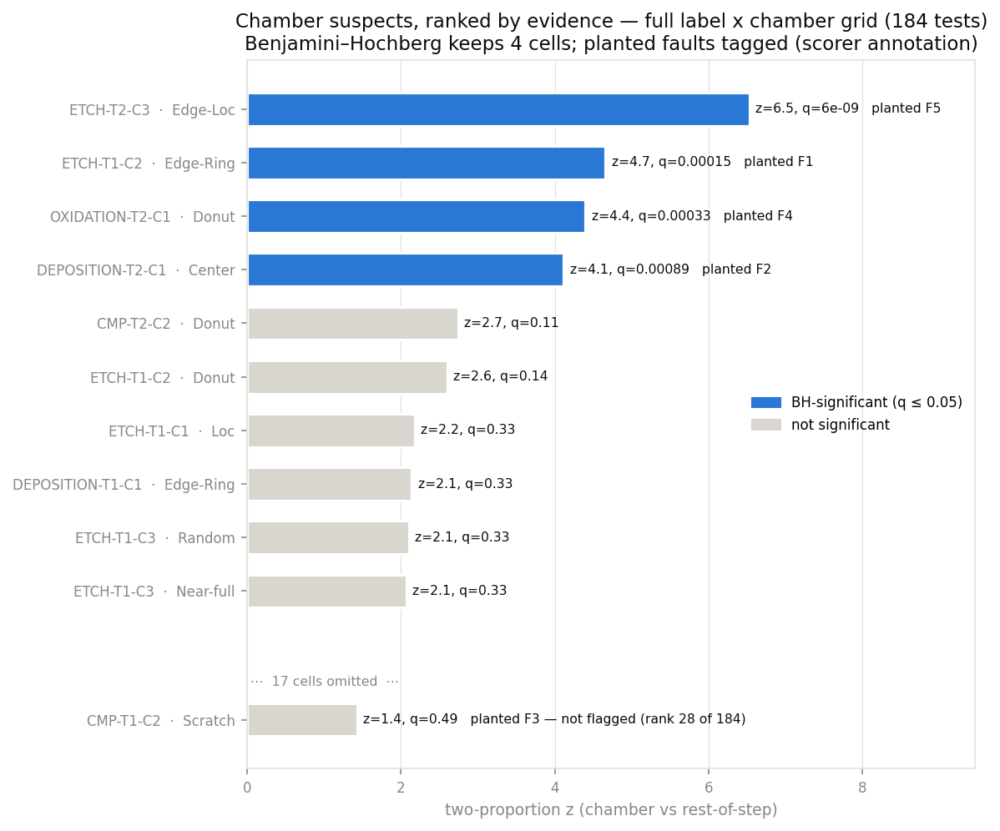
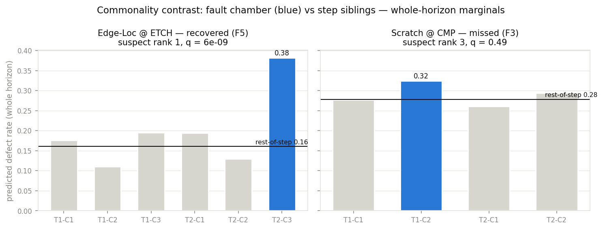
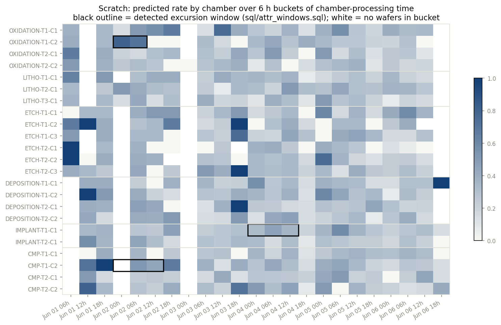

# Root-cause attribution — scored against planted faults

Phase 2 closes the loop: from *which defect signature is on the wafer*
(classifier outputs, Phase 1) to *which chamber put it there, and when*.
Everything analytical is SQL (`sql/attr_*.sql`); Python renders figures and
aggregates the scorer's rows. The analysis side reads `classifier_outputs`
only — `ground_truth_faults` enters exactly once, in `sql/score_faults.sql`,
to score the verdicts after the fact (enforced by
`tests/test_attribution.py::test_firewall_analysis_sql_never_reads_ground_truth`).

Reproduce with `python scripts/attribute.py` (baseline DB: seed 42, 1,000
wafers, 5 planted faults, classifier noise on this draw: 9 escapes +
8 false alarms across 8,000 label decisions).

## Method

**Suspect ranking — `sql/attr_suspects.sql`.** For every (signature label,
chamber) cell — 8 × 23 = 184 tests — contrast the defect rate of wafers that
passed through the chamber against wafers through the *other chambers of the
same step* (every wafer visits every step exactly once, so rest-of-step is
the natural control). One-sided pooled two-proportion z-test,
Benjamini–Hochberg across the full grid at FDR 0.05, suspects ranked per
label by evidence. The normal tail is inlined as the Abramowitz–Stegun
7.1.26 approximation (max error 1.5e-7 — orders below any BH decision here)
because stock DuckDB lacks `erf`; the query stays portable arithmetic +
window functions. Tests cross-check z, p and q against scipy/numpy.

**Window localisation — `sql/attr_windows.sql`.** Per cell: defect rate in
6 h buckets of *chamber-processing time* (a fault is an event in chamber
time, not inspection time), centred 3-bucket rolling rate, then simple
threshold-crossing: flag buckets where the rolling rate clears rest-of-step
by 2 binomial standard errors (min 10 wafers in the rolling window).
Contiguous flagged runs (gaps-and-islands) of ≥ 2 buckets and ≥ 5 excess
defects are excursions; the largest-excess run is the reported window.
Threshold-crossing, not CUSUM — localisation only has to place the window
well enough for a maintenance-log pull, and the scorer prices the
simplicity (window IoU below).

## Scored results

| metric | value |
|---|---|
| planted faults | 5 |
| **attribution precision@1** | **1.000** (4 flagged rank-1 cells, all true faults) |
| **attribution recall@1** | **0.800** (4 of 5 faults at rank 1, BH-significant) |
| precision@3 / recall@3 | 1.000 / 0.800 (no fault gained by widening to top-3) |
| grid false discoveries | 0 of 184 tests at FDR 0.05 |
| **mean window IoU** (4 recovered) | **0.866** |
| mean abs. detection latency | 3.25 h (≤ 1 bucket + rolling smear) |

| fault | chamber · label | p_acquire | rank | q | window IoU | latency |
|---|---|---|---|---|---|---|
| F1 | ETCH-T1-C2 · Edge-Ring | 0.70 | **1** | 1.5e-4 | **1.00** | 0 h |
| F2 | DEPOSITION-T2-C1 · Center | 0.50 | **1** | 8.9e-4 | 0.86 | −6 h |
| F3 | CMP-T1-C2 · Scratch | 0.50 | 3 (n.s., q=0.49) | — | (0.45) | (+14 h) |
| F4 | OXIDATION-T2-C1 · Donut | 0.25 | **1** | 3.3e-4 | 0.81 | +6 h |
| F5 | ETCH-T2-C3 · Edge-Loc | 0.60 | **1** | 6.0e-9 | 0.80 | +1 h |

Negative latency = the rolling window smears the excursion one bucket
early; F3's row is parenthesised because its cell never cleared BH — the
window exists but no analyst would have been routed to it by the ranking.

## The false suspect BH was hired to kill

Phase 1's EDA flagged ETCH-T1-C1 · Loc (+0.075 raw excess) as a rate
excursion sitting *above* a true fault in the eyeball ranking. Under the
test it lands at z = 2.2, q = 0.33 — comfortably not significant. Across
the 184-cell grid, BH keeps exactly the four planted-fault cells and
nothing else. That is the point of the correction: an eyeball list of the
top-5 excursions contains one routing coincidence; the FDR-controlled list
contains zero.

## The miss, honestly: F3 (Scratch @ CMP-T1-C2)

F3 is a mid-strength fault (p_acquire 0.50) active for only 40 h of the
~140 h horizon, on the label with the second-highest baseline (0.29
line-wide). Its whole-horizon marginal — 0.324 vs 0.278 rest-of-step —
is only z = 1.4: the out-of-window ~100 h of normal traffic dilutes a real
in-window excursion below detectability. This is a *design limitation of
whole-horizon commonality testing*, not classifier noise (9 escapes across
all labels can't move a z from 1.4 to 4).

The time-resolved view sees what the marginal can't:
CMP-T1-C2 · Scratch produces a detected excursion window (Jun 02
00:00–18:00, IoU 0.45 with the true window) and the chamber leads its step
(z = 1.43 vs ≤ 0.17 for all three CMP siblings). But upgrading that into a
*detection* would mean testing significance on a window selected by
scanning the data — a selection-bias trap that needs proper scan statistics
(or CUSUM control limits) to do honestly. Deliberately not built here: the
honest statement is "whole-horizon commonality at FDR 0.05 recovers faults
that cover ≳ a third of the horizon; shorter excursions need a sequential
detector." Phase 3's intensity sweep will map that boundary.

## Windows localise; they do not detect

28 cells produced an excursion window; only 4 sit on BH-significant cells.
That is expected, and instructive: Edge-Ring alone yields 10 windows, 9 at
innocent chambers — eight of them sitting at *other* steps inside F1's
active period (Jun 02–04), plus one same-step noise run. The eight are
echoes: the F1-struck wafers pass through every step, so every chamber
that processed a burst of them shows an Edge-Ring rate bump. The per-step contrast in the suspects test is what
concentrates the evidence at ETCH-T1-C2 (25 excess defects vs 6–13 for the
echoes) and BH is what silences the rest. The workflow is therefore
strictly: **ranked suspects first, windows second** — reading windows as
alarms would page 24 innocent chamber owners. Phase 3's correlated-routing
config attacks exactly this separation.

## F4 was supposed to be hard

F4 (Donut, p_acquire 0.25 over a 0.19 baseline) was planted as the
weak-fault miss candidate — and came back rank 1 at q = 3.3e-4. With
~70 exposed wafers among 246 through the chamber, a +0.20 rate lift is
simply detectable at these sample sizes. The honest detection limit is
therefore *not yet measured* by this draw; Phase 3(d)'s intensity sweep
(p_acquire ↓ toward the baseline) is what produces the
detection-vs-intensity curve.
