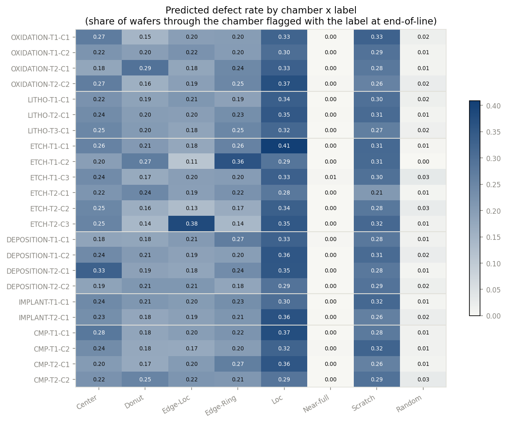
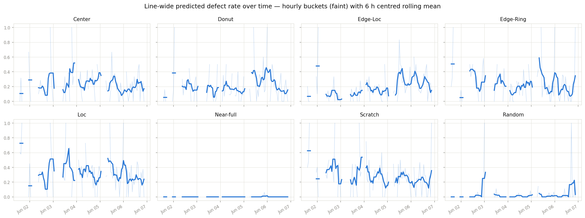
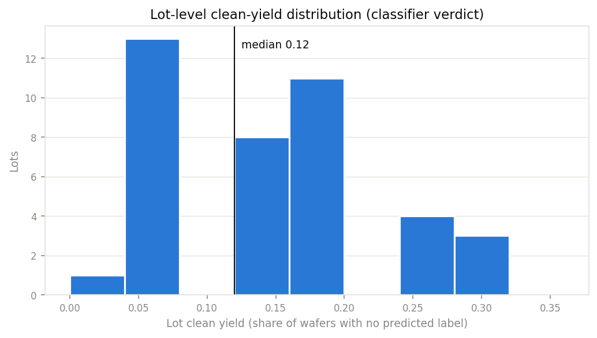
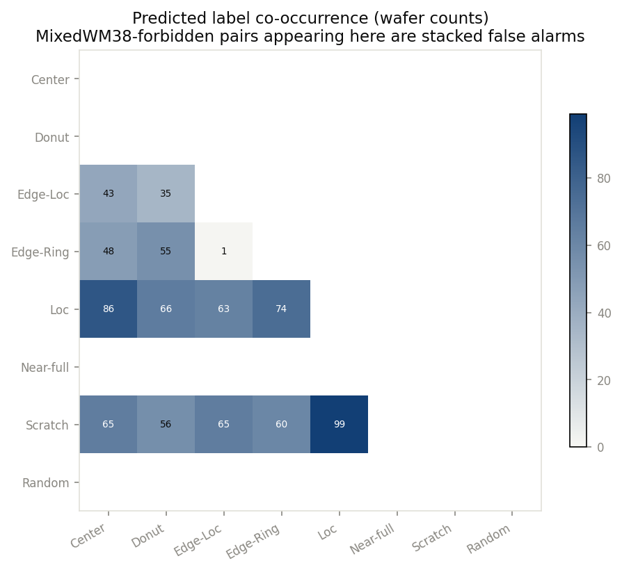

# SQL EDA — classifier outputs on the simulated line

Every figure below is drawn verbatim from one named query in `sql/`
(`python scripts/eda.py` re-runs them all). All of it reads
**`classifier_outputs` only** — the analysis side never joins the
`ground_truth_*` tables, so anything visible here is visible the way it
would be in a real fab: through a noisy end-of-line classifier. Baseline
DB: seed 42, 1,000 wafers, horizon 2026-06-01 → 2026-06-06.

The classifier's noise on this draw (scorer-side summary printed by
`scripts/attach_and_predict.py`, not used by any query here): 9 label-level
escapes and 8 false alarms across 8,000 label decisions.

## Predicted label prevalence — `sql/eda_label_prevalence.sql`

| label | predicted rate |
|---|---|
| Loc | 0.334 |
| Scratch | 0.290 |
| Center | 0.236 |
| Edge-Ring | 0.223 |
| Edge-Loc | 0.197 |
| Donut | 0.196 |
| Random | 0.015 |
| Near-full | 0.001 |

The line is deliberately defect-dense (~85 % of wafers carry ≥1 label —
the conservative regime for attribution, since excursions must beat a high
common baseline).

## Defect rate by step/tool/chamber — `sql/eda_rate_by_chamber.sql`

**Eyeball check (the point of this pass): planted faults are visible as
chamber-level rate excursions before any statistics.** Top
chamber-vs-step-mean excursions:

| chamber | label | rate | step mean | excess |
|---|---|---|---|---|
| ETCH-T2-C3 | Edge-Loc | 0.382 | 0.197 | **+0.185** |
| ETCH-T1-C2 | Edge-Ring | 0.362 | 0.223 | **+0.139** |
| OXIDATION-T2-C1 | Donut | 0.293 | 0.196 | **+0.097** |
| DEPOSITION-T2-C1 | Center | 0.331 | 0.236 | **+0.095** |
| ETCH-T1-C1 | Loc | 0.409 | 0.334 | +0.075 |

The first four are true planted faults (F5, F1, F4, F2). The fifth is a
routing-noise coincidence — exactly why Phase 2 needs significance testing
with multiple-comparison control rather than a ranked eyeball list. The
fifth fault, F3 (Scratch @ CMP-T1-C2), does *not* make this table: its
chamber leads its step (0.324 vs 0.261–0.294 siblings) but its 40 h window
covers only a quarter of the horizon, so the whole-horizon marginal dilutes
it below the noise entries. Time-resolved localisation (Phase 2) is what
should recover it.

## Rates over time — `sql/eda_rate_over_time.sql`

Line-wide hourly rates (6 h centred rolling mean). Even diluted by
fault-free chambers, the windows read: Edge-Ring runs hot early (F1,
h24–72), Donut rises late (F4, h90–130), Edge-Loc climbs at the end (F5,
h95–135). Gaps are hours with no inspections — lots arrive in bursts.

## Lot-level yield — `sql/eda_lot_yield.sql`

Median lot clean-yield 0.12 (defect-dense by design); range 0.00
(LOT0004) to 0.32. Lot-to-lot spread comes from both routing (which
chambers a lot hit, and when) and baseline contamination draws.

## Label co-occurrence — `sql/eda_label_cooccurrence.sql`

Predicted pairs reproduce MixedWM38's structure: Loc and Scratch mix with
everything (Loc+Scratch is the top pair, 99 wafers), Near-full and Random
pair with nothing. One structurally forbidden pair appears —
Edge-Loc+Edge-Ring on a single wafer — which can only be a classifier
false alarm stacked on a real label; a useful reminder that
`classifier_outputs` is an *observation* of the wafer, not the wafer.
