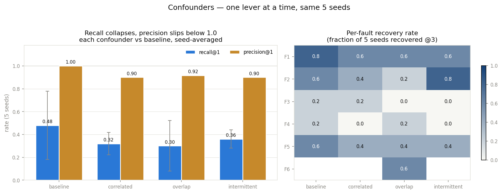
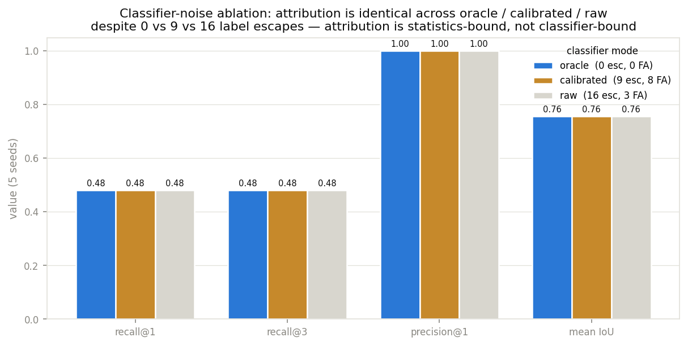
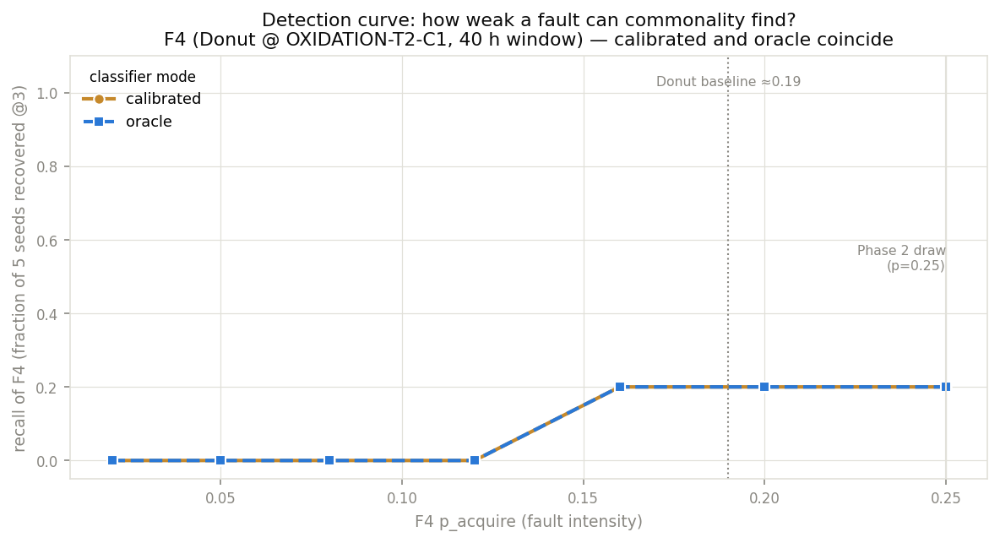

# Confounders + sensitivity — where the attribution breaks

Phase 2 scored the pipeline on one favourable draw (seed 42) and recovered
4 of 5 planted faults at precision@1 = 1.00. Phase 3 asks the harder question:
*does that hold when the fab fights back, and how much of it was luck?* Three
adversarial sim configs (one lever each), a five-seed re-run of the baseline,
and a classifier-noise ablation — all driving the **unchanged** Phase 2 SQL.

Reproduce with `python scripts/sensitivity.py` (~2 min, all CPU). Nothing here
is new analysis: `src/wafer_rootcause/sensitivity.py` only orchestrates
`attr_suspects.sql` / `attr_windows.sql` / `score_faults.sql` over new configs
and ablation modes. The firewall is unchanged — analysis reads
`classifier_outputs` only; oracle mode and the scorer read ground truth on the
already-blessed harness/scorer side.

## First, the honest recalibration: seed 42 was lucky

Running the **baseline** config over five seeds instead of one:

| | seed 42 (Phase 2) | 5-seed mean |
|---|---|---|
| recall@1 | 0.80 | **0.48 ± 0.30** |
| precision@1 | 1.00 | **1.00** |
| mean window IoU | 0.87 | 0.76 |

Per-fault recovery rate (fraction of 5 seeds recovered, rank ≤ 3 + BH-significant):
**F1 0.8 · F2 0.6 · F5 0.6 · F3 0.2 · F4 0.2**. The strong faults (F1/F2/F5,
p_acquire ≥ 0.5) land most of the time; the diluted F3 and the weak F4 are
coin-flips. The ±0.30 spread on recall is the headline: **a single draw is not
a measurement of this method's recall** — Phase 2's 0.80 was the top of the
distribution, not the centre. Precision, though, is rock-solid: across every
baseline seed BH flagged only true faults.

## Confounders — one lever at a time, same five seeds

Each config changes exactly one thing versus `sim_baseline.yaml` (same seeds,
route, baseline contamination, classifier); the diff is a comment header in the
config file.

| scenario | recall@1 | precision@1 | mean flagged@1 | what the lever does |
|---|---|---|---|---|
| baseline | 0.48 | **1.00** | 2.4 | — |
| correlated | 0.32 | **0.90** | 2.0 | DEPOSITION chamber choice follows ETCH's (strength 0.8) |
| overlap | 0.30 | **0.92** | 2.0 | second Center fault (F6 @ IMPLANT) overlapping F2 in time |
| intermittent | 0.36 | **0.90** | 2.2 | F1 duty-cycled 8 h on / 8 h off inside its window |

Two things move, and it is worth being precise about which:

**Recall drops under every confounder** (0.48 → 0.30–0.36). Each lever removes
or dilutes in-window evidence: correlated routing shares a fault's struck
wafers across coupled chambers, the overlap pair mutually inflate each other's
rest-of-step control group, and the duty cycle simply halves exposure. None of
these is a classifier problem; they are all *less signal per suspect cell*.

**Precision slips from 1.00 to ~0.90** — but **not** the way the correlated-
routing trap was designed to break it. The design intent was that F1's
Edge-Ring wafers, funnelled by the coupling into one innocent DEPOSITION
chamber, would make that chamber out-rank the true ETCH source and get blamed.
That did **not** happen: the per-step contrast keeps each fault's evidence
maximal at its source, so the coupled decoy never reaches the top of its
label's ranking (on seed 42 it is not even in Edge-Ring's top five). What
actually costs the 0.10 of precision is subtler and honest to report:

1. **BH is doing exactly its job.** At FDR 0.05, ~1 in 20 flagged cells is
   allowed to be false. Reshaping the grid's null distribution (correlation,
   an extra fault) is enough for BH to admit an occasional false discovery at
   roughly the nominal rate — e.g. an Edge-Loc bump at an OXIDATION chamber
   (q = 0.040) on one seed. This is a controlled false-discovery *rate*, not a
   broken method: over 4 scenarios × 5 seeds the flagged list is still ~90 %
   true faults.
2. **Near-zero-baseline labels throw small-count artifacts.** Near-full and
   Random sit at ~0 % line-wide, so a single wafer through a chamber can read
   as a z ≈ 3 "excursion" (one seed flagged Near-full at an ETCH chamber on
   two wafers). A production deployment would floor these labels with a minimum
   count gate; the window detector already does (`min_excess`), the suspect
   test deliberately does not, so the artifact is visible here.

The takeaway for the *correlated* case specifically: **the confounder degrades
sensitivity, and BH's controlled false-discovery rate becomes visible, but the
per-step commonality contrast is not fooled into blaming the coupled innocent
chamber.** That separation — rank suspects first (per-step contrast), read
windows second — is what Phase 2 argued for, and it survives correlated routing.

### The overlap case, mechanically

F2 (Center @ DEPOSITION) and F6 (Center @ IMPLANT) share a signature and
overlap 40 h in time. Each fault's struck wafers route uniformly through the
*other* step, so F6's Center-bearing wafers land in DEPOSITION's rest-of-step
control group and shrink F2's contrast (and vice versa). In the seed-42 draw
both are still found — F6 at rank 1 (q = 1.6e-6), F2 pushed to rank 2 and just
under BH (q = 0.081) — but across seeds F2's recovery falls to 0.2. Two
simultaneous same-signature excursions on different steps are the case
whole-horizon commonality handles worst, because the "rest of step" control is
no longer clean.

### The intermittent case

A 50 % duty cycle roughly halves F1's effective evidence, dropping the
strongest planted fault's recovery from 0.8 to 0.6. But when it *is* found the
window detector still traces it well: on seed 42 F1's detected window has
IoU 1.00 against the **envelope** (the scorer judges against the 24–72 h
envelope, not the on-phases — a detector that perfectly followed the duty
cycle would score IoU 0.5, so the 1.00 reflects the rolling window bridging the
off-phases, which is the right behaviour for localising "which chamber, roughly
when").

## Classifier-noise ablation — the null result

The same baseline, three ways of filling `classifier_outputs`: **oracle** (the
simulated truth — a perfect classifier), **raw** (sigmoid(logit) > 0.5 on the
cached logits), **calibrated** (per-label temperature + tuned τ, Phase 1's
shipped path). No new inference — raw and oracle reuse the cached logits and
the ground-truth labels respectively.

| mode | label escapes | false alarms | recall@1 | precision@1 | mean IoU |
|---|---|---|---|---|---|
| oracle | 0 | 0 | 0.48 | 1.00 | 0.757 |
| calibrated | 9 | 8 | 0.48 | 1.00 | 0.757 |
| raw | 16 | 3 | 0.48 | 1.00 | 0.757 |

**Identical to three decimal places, despite 0 vs 9 vs 16 escapes.** This is
the finding, and it is a null: classifier quality — the entire subject of
wafer-mixed's threshold-tuning story — buys *nothing* in attribution terms on
this line. The reason is structural: attribution aggregates ~250 wafers per
(chamber, label) cell, and the faults that are recoverable at all lift a
chamber's rate by 0.2–0.5. A handful of label errors scattered across 8,000
decisions cannot move a chamber-level proportion far enough to change a z-test
verdict, let alone the BH ranking. Even the naive raw @0.5 threshold — which
trades calibrated's 9 escapes for 16 — lands on the same suspects.

The honest closing of wafer-mixed's loop: **fewer escapes did not improve root
cause.** Attribution here is *statistics-bound* (how many wafers per cell, how
much the fault lifts the rate, how much the horizon dilutes it), not
*classifier-bound*. The classifier has to be good enough that the signature is
mostly right; past that floor, more accuracy is wasted on this task. (This
would flip if faults were rare enough that per-cell counts fell to tens of
wafers — then each escape would matter. That regime is the sweep, next.)

## Detection curve — how weak a fault can commonality find?

Sweep F4's intensity (p_acquire) from near the Donut baseline (~0.19) upward,
five seeds each, calibrated vs oracle:

| p_acquire | 0.02 | 0.05 | 0.08 | 0.12 | 0.16 | 0.20 | 0.25 |
|---|---|---|---|---|---|---|---|
| recall (calibrated) | 0.0 | 0.0 | 0.0 | 0.0 | 0.2 | 0.2 | 0.2 |
| recall (oracle) | 0.0 | 0.0 | 0.0 | 0.0 | 0.2 | 0.2 | 0.2 |

Two readings. First, **the floor is high**: for a 40 h fault on a
moderate-baseline label (Donut, 0.19), whole-horizon commonality needs
p_acquire ≳ 0.16 to detect *at all*, and even at 0.25 it recovers only 1 seed
in 5. This is the whole-horizon dilution limit Phase 2 flagged on F3, now
measured — a fault covering ~30 % of the horizon must roughly double its
chamber's local rate before the marginal test sees it. Phase 2's "F4 came back
rank 1 at 0.25" was, again, the lucky seed.

Second, **calibrated and oracle coincide at every intensity** — the ablation
null holds all the way down to the detection floor. Even where the fault is
barely detectable, the bottleneck is the fault's strength and the horizon
dilution, not the 9 label escapes.

## Where the method breaks, and how you'd know in production

| failure mode | symptom here | production signal |
|---|---|---|
| Short excursion, long horizon | F3 (Phase 2), F4 sweep: recall 0 until p high | whole-horizon suspect rank low **while** a window is detected — the split says "time-resolve me" (Phase 2 §F3) |
| Two same-signature faults, different steps | overlap: F2 recovery 0.6 → 0.2 | rest-of-step control rate itself elevated vs line history; ≥ 2 flagged chambers same label |
| Correlated routing | precision 1.00 → 0.90 via BH FDR, not decoy | flagged cell with high step-partner correlation and no maintenance/SPC corroboration |
| Near-zero-baseline label | one-wafer "excursions" flagged | z high but `n_cham` tiny — needs the same `min_excess` gate the window detector uses |
| Weak fault near baseline | F4: recall 0 below p≈0.16 | nothing — this is the detection floor; report it as a **sensitivity bound**, not a clean bill |

The load-bearing honest statement: **this pipeline measures attribution
*precision* reliably (BH holds ~0.90–1.00 even under confounders) but its
*recall* is both low and high-variance** — 0.48 ± 0.30 on the baseline, worse
under every confounder — and is set by fault strength × duration × baseline
dilution, not by classifier quality. In production you would trust a flagged
suspect, treat a *quiet* result as "no fault covering ≳ a third of the horizon
at ≳ 2× local rate," and reach for a sequential detector (CUSUM / scan
statistics) for the short-and-strong excursions this whole-horizon test is
structurally blind to.
